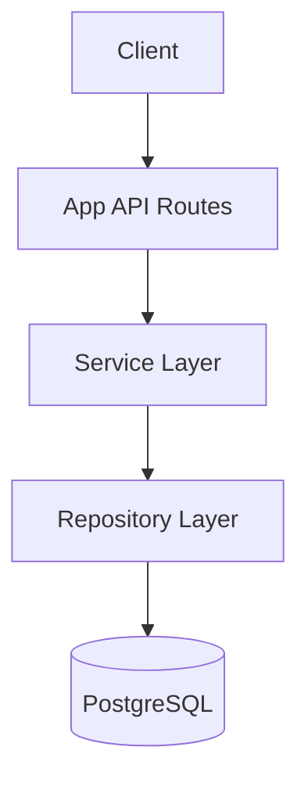

# Architecture - Credit Expense API

## Application Layering
The project follows a modular Service-Repository pattern within the Next.js App Router structure.



### 1. API Routes (`app/api/`)
Handles HTTP concerns, authentication extraction, request validation (Zod), and response formatting using `ApiResponse`.

### 2. Service Layer (`modules/*/service/`)
Contains business logic, state-aware validations (Conflict/Not Found checks), and orchestration of multiple repository calls.

### 3. Repository Layer (`modules/*/repository/`)
Handles all direct database interactions using Drizzle ORM. Implements soft-delete filtering logic and balance math using SQL expressions.

## Response Standards
All APIs return a consistent JSON structure defined in `core/responses.ts`.

### Success Response
```json
{
  "success": true,
  "message": "Operation successful",
  "data": {}
}
```

### List Response
```json
{
  "success": true,
  "data": [],
  "pagination": {
    "page": 1,
    "limit": 20,
    "total": 100,
    "hasNext": true
  }
}
```

## Soft Delete Strategy
- **ACTIVE**: `deleted_at IS NULL`
- **DELETED**: `deleted_at IS NOT NULL`
- **Endpoints**:
    - `DELETE /api/resource/:id`: Sets `deleted_at = NOW()`.
    - `PATCH /api/resource/:id/restore`: Sets `deleted_at = NULL`.
    - `DELETE /api/resource/:id/force`: Physical `DELETE`.
    - `GET /api/resource/deleted`: Lists only deleted items.

## Authentication Flow
1. User registers/logs in via `app/api/auth/`.
2. Server issues JWT stored in client.
3. Protected routes use `getCurrentUser()` which verifies JWT via `modules/auth/service/jwt.service.ts`.
4. `userId` is passed to all service methods to ensure data isolation.
