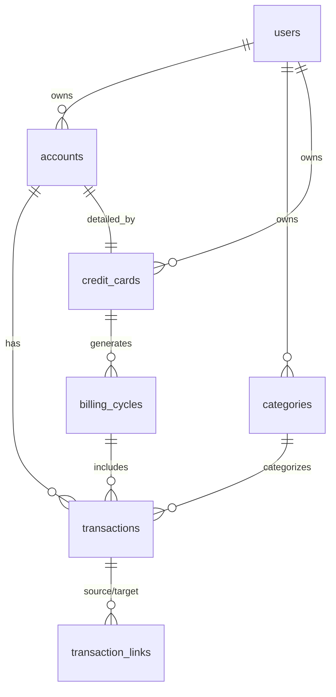

# Database Schema - Credit Expense API

## Entity Relationship Diagram

## Tables

### users
| Column | Type | Constraints |
| :--- | :--- | :--- |
| id | uuid | PK, Default Random |
| email | text | Unique, Not Null |
| password | text | Not Null |
| deleted_at | timestamp | Soft Delete |

### accounts
| Column | Type | Constraints |
| :--- | :--- | :--- |
| id | uuid | PK |
| user_id | uuid | FK -> users.id |
| type | enum | cash, bank, credit_card |
| balance | decimal | Default 0.00 |
| deleted_at | timestamp | Soft Delete |

### credit_cards
| Column | Type | Constraints |
| :--- | :--- | :--- |
| id | uuid | PK |
| account_id | uuid | FK -> accounts.id, **UNIQUE** |
| billing_day | decimal | 1-31 |
| grace_period_days | decimal | e.g. 20 |
| deleted_at | timestamp | Soft Delete |

### transactions
| Column | Type | Constraints |
| :--- | :--- | :--- |
| id | uuid | PK |
| account_id | uuid | FK -> accounts.id |
| category_id | uuid | FK -> categories.id |
| billing_cycle_id | uuid | FK -> billing_cycles.id |
| kind | enum | expense, income, transfer, payment, refund |
| direction | enum | inflow, outflow |
| amount | decimal | Not Null |
| transaction_datetime | timestamp | Not Null |
| settlement_date | timestamp | Not Null (Date Only) |
| deleted_at | timestamp | Soft Delete |

### transaction_links
*Used for transfers and credit card payments.*
| Column | Type | Constraints |
| :--- | :--- | :--- |
| source_transaction_id | uuid | FK -> transactions.id |
| target_transaction_id | uuid | FK -> transactions.id |
| link_type | varchar | e.g., 'transfer' |

## Indexes
- `user_id` on all owned tables.
- `account_id` on transactions and credit_cards.
- `transaction_datetime` on transactions.
- `billing_cycle_id` on transactions.
